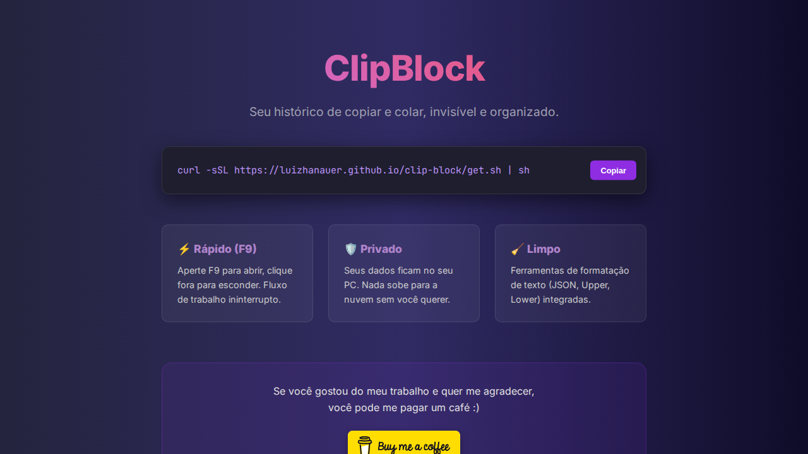

# 📋 Clip Block


**Clip Block** é um gerenciador de área de transferência (clipboard) leve, rápido e extensível, construído para desenvolvedores que buscam produtividade. Ele não apenas armazena seu histórico, mas permite transformar e organizar seus dados de forma inteligente.

---
##  📸 Screenshot


---
## ⚡ Instalação Rápida (Linux)

Para instalar o **Clip Block** instantaneamente via terminal, execute o comando abaixo:

```bash
curl -sSL https://luizhanauer.github.io/clip-block/get.sh | sh
```
> Este script baixa o binário mais recente, configura as permissões necessárias e prepara o ambiente para você começar a usar imediatamente.

---

## ✨ Funcionalidades Principais

### 🔍 Gestão Inteligente
* **Monitoramento em Tempo Real:** Captura automática de textos copiados via Go routine eficiente.
* **Favoritos (Pin):** Fixe clips importantes para que nunca sejam removidos durante as limpezas automáticas.
* **Paginação Fluida:** Gerenciamento de grandes volumes de dados sem perda de performance no frontend.

### 🛠️ Ferramentas de Texto (Power User)
O Clip Block detecta automaticamente se o conteúdo é um código e oferece ferramentas de transformação rápida:
* **Formatador JSON:** Embeleze payloads bagunçados com um clique.
* **Minificador:** Reduza o tamanho de códigos ou JSONs.
* **Conversor de Case:** Alterne entre `MAIÚSCULAS` e `minúsculas` instantaneamente.
* **Syntax Highlighting:** Visualização de código (Go, JS, JSON, Bash) integrada com Highlight.js.

### 🧩 Mesclagem e Seleção Múltipla
* Selecione múltiplos clips e combine-os em um novo item.
* Formatos de mesclagem: **Lista (Markdown)**, **Parágrafos** ou **Bloco de Código**.

### 🧹 Manutenção e Segurança
* **Limpeza Inteligente:** Opções para apagar clips de hoje, com mais de 30 dias ou todos os itens não fixados.
* **Persistência Local:** Seus dados são salvos em um banco SQLite local (`~/.local/share/clip-block/`).
* **Atalho Global:** Alternância de visibilidade instantânea via tecla **F9**.

---

## 🚀 Tecnologias Utilizadas

O projeto utiliza uma arquitetura moderna dividida entre um backend performático em Go e uma interface reativa em Vue.js:

| Camada | Tecnologia |
| :--- | :--- |
| **Framework** | [Wails v2](https://wails.io/) |
| **Linguagem Backend** | Go (Golang) |
| **Banco de Dados** | SQLite3 (via `go-sqlite3`) |
| **Frontend** | Vue 3 (Composition API) + TypeScript |
| **Estilização** | Tailwind CSS (Tema Dark/Catppuccin) |
| **Ícones** | Lucide Vue Next |
| **Data/Hora** | Date-fns |

---

## 📦 Como Instalar e Rodar

### Pré-requisitos
* [Go](https://golang.org/dl/) (1.21+)
* [Node.js](https://nodejs.org/) & NPM
* [Wails CLI](https://wails.io/docs/gettingstarted/installation)
* Bibliotecas de desenvolvimento do SQLite (ex: `libsqlite3-dev` no Ubuntu)

### Clonando e Executando
Clone o repositório
```bash
git clone https://github.com/luizhanauer/clip-block.git
```
Entre na pasta
```bash
cd clip-block
```
Execute em modo de desenvolvimento
```bash
wails dev
```
Execute em modo de produção
```bash
wails build
```

O executável será gerado na pasta `build/bin`.

---

## ⌨️ Atalhos e UX

* **F9:** Mostra/Oculta a janela principal.
* **Ctrl/Shift + Click:** Seleciona múltiplos clips no Card.
* **Perda de Foco:** O aplicativo se oculta automaticamente ao clicar fora da janela para manter seu workflow limpo.

---

## 🗂️ Estrutura de Pastas Relevante

* `/app.go`: Lógica principal, eventos de janela e watcher de clipboard.
* `/internal/core/domain`: Definição da entidade `Clip` e interfaces do repositório.
* `/internal/infra/storage`: Implementação do repositório em SQLite.
* `/frontend/src/App.vue`: Orquestração da interface e lógica de paginação.
* `/frontend/src/components/ClipCard.vue`: Componente rico para exibição e edição de clips.

---

## Contribuição

Contribuições são bem-vindas! Se você encontrar algum problema ou tiver sugestões para melhorar a aplicação, sinta-se à vontade para abrir uma issue ou enviar um pull request.

Se você gostou do meu trabalho e quer me agradecer, você pode me pagar um café :)

<a href="https://www.paypal.com/donate/?hosted_button_id=SFR785YEYHC4E" target="_blank"></a>

## Licença

Este projeto está licenciado sob a Licença MIT. Consulte o arquivo LICENSE para obter mais informações.

<p align="center">Desenvolvido por <strong>Luiz Hanauer</strong></p>